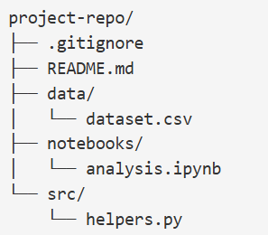

# LA Crime Analysis — COMP 2040 Final Project

This project analyzes crime data from the City of Los Angeles. The goal is to clean the dataset, explore crime patterns, engineer useful features, and build one simple predictive model. The notebook walks through the full workflow step by step, from raw data to a baseline Logistic Regression model.

---

## 1. Project Overview

This project focuses on:

- cleaning and preparing the LA crime dataset  
- exploring crime patterns across time, location, and victim demographics  
- engineering features such as `HOUR` and a binary `is_violent` target  
- building **one simple predictive model** (Logistic Regression)  
- interpreting the results and summarizing the workflow  

The goal is not to build a perfect model, but to demonstrate a clean, reproducible analysis pipeline from raw data to a basic predictive model.

---

## 2. How to Run the Analysis

### **Install Required Packages**

Before running the notebook, install the necessary Python packages:
`pip install pandas numpy matplotlib seaborn scikit-learn`

If a `requirements.txt` file is included, you can also do:
`pip install -r requirements.txt`

### **Run the Notebook**

1. Clone the repository  
2. Ensure the dataset is placed inside the `/data` folder  
3. Open `notebook.ipynb`  
4. Run all cells from top to bottom  

The notebook uses **relative paths**, so as long as the dataset is inside the `data/` directory, the analysis will run on any machine.

---

## 3. Project Structure

---

## 4. Helper Module (`src/helpers.py`)

The helper module keeps the notebook clean by moving repeated logic into reusable functions. It contains:

- **filter_by_year(df, year)** — filters the dataset to a specific year  
- **count_values(df, column)** — returns value counts for any column  
- **get_top_n(df, column, n)** — returns the top N categories in a column  
- **group_and_count(df, group_col, count_col)** — groups by a column and counts occurrences  

Each function includes a clear docstring explaining what it does.

---

## 5. Data Cleaning Summary

Key cleaning steps:

- removed unused columns  
- fixed data types  
- extracted the hour from the time column  
- created the `is_violent` target variable  
- handled missing values (dropped rows with NaNs for modeling)  
- encoded categorical variables  

The cleaned dataset was then used for EDA and modeling.

---

## 6. Exploratory Data Analysis (EDA)

The notebook includes visuals exploring:

- crime counts by hour  
- crime counts by area  
- top crime categories  
- victim age distribution  
- violent vs non‑violent crime patterns  

These visuals help build intuition before modeling.

---

## 7. Predictive Model

A simple **Logistic Regression** model was trained to predict whether a crime is violent or non‑violent.

### **Model Notes**
- Logistic Regression was chosen because it is simple and easy to explain  
- Missing values were removed before training to avoid errors  
- One‑hot encoding was used for categorical features  

### **Model Results**
The model produced perfect scores (accuracy, precision, recall, F1 = **1.00**).  
These results are **not realistic** and mainly reflect the impact of dropping over 200,000 rows with missing values.

For this assignment, the goal is to demonstrate a clean predictive workflow, so the simplified approach is acceptable.

---

## 8. Conclusion

This project demonstrates a full data analysis pipeline:

- cleaned and prepared the dataset  
- explored crime patterns  
- engineered features  
- built one simple predictive model  
- interpreted the results  

The project highlights how data preparation choices can strongly influence model performance. In a real project, I would avoid dropping that many rows and would use imputation or a model that handles missing values.

